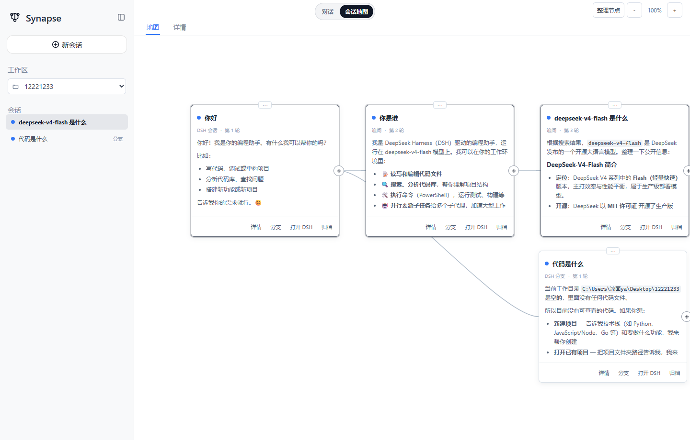

# dsh-synapse


**A visual, non-linear conversation workspace plugin for DeepSeek Harness.**

> **Fork note**: this is a maintenance fork of [liangmianya/dsh-synapse](https://github.com/liangmianya/dsh-synapse) (MIT, upstream v0.3.0). Changes over upstream:
> - `client.js` declares the loader-provided `require` parameter (`factory: (require) => ...`) so the client module boots on dsh 0.1.0-rc.6's module loader (`ReferenceError: require is not defined` otherwise).
> - The floating bubble view switcher (`.dsh-synapse-switch`) and its legacy overlay entry are removed. The 会话地图 canvas is registered as a native conversation view tab (`conversation.view` slot, id `synapse`, order 15) — it appears in the main tab bar next to 对话/轨迹/记忆 instead of any custom chrome.

[中文](README.zh.md) | English



---
## English

`dsh-synapse` is a standalone DeepSeek Harness Web plugin. It does not replace DSH models, tools, sessions, or permissions. Instead, it adds a visual workspace on top of the native conversation UI, turning related sessions, follow-ups, and forks into an explorable conversation map.

Complex work is rarely linear. You may need to preserve one approach, return to an earlier turn, and explore another path without losing context. Synapse keeps those relationships on one canvas while leaving DSH's native session behavior intact.

### Features

| | Feature | Description |
|---|---|---|
| 🗺️ | Session map | Switch between the native DSH chat and a visual canvas |
| 🌿 | Visible branches | Create forks through DSH native session forks and connect them at their actual branching turn |
| 📁 | Workspace-aware | Reflect DSH workspaces and directory ownership when creating or browsing sessions |
| 📥 | Live projection | Project user messages and assistant replies into cards, with streaming updates in the detail view |
| 🔧 | Folded tool process | Tool calls and results pair by `callId` and fold into the assistant reply card instead of becoming standalone cards |
| ⚡ | Session sync | The native chat and the session map sync the current session bidirectionally — switching on either side highlights the other |
| 🎨 | Canvas interaction | Pan, zoom (up to 4×), move cards (positions persist), one-click focus on the current session, and smooth scrolling inside each card |
| 🔒 | Native sessions stay native | Opening, prompting, creating, and archiving sessions remains DSH-owned; Synapse only changes how they are viewed and organized |

### Quick start

```powershell
corepack pnpm dsh plugin --profile web add github:liangmianya/dsh-synapse
corepack pnpm dsh web
```

Open `http://127.0.0.1:3080/` and use the top "Session Map" switch.

### Installation

Prerequisites: a DeepSeek Harness with the `dsh plugin` profile plugin mechanism (2026-08 or later) and Node.js `>= 22.19`.

> [!NOTE]
> This plugin **only supports the `web` profile**: its patch inserts into the Web composition and reuses the existing DSH server rather than running a second application process.

#### Install from GitHub

```powershell
corepack pnpm dsh plugin --profile web add github:liangmianya/dsh-synapse
```

GitHub installs run this package's `prepare` script (`node --check` syntax validation).

> [!IMPORTANT]
> pnpm ≥10 blocks a git dependency's build scripts until explicitly allowed. If the install is blocked, copy the **exact key pnpm printed** — the package name plus its fetched tarball URL, which embeds the commit, **not the bare package name** — into the DSH profile's `pnpm-workspace.yaml`:

```yaml
allowBuilds:
  "dsh-synapse@https://codeload.github.com/liangmianya/dsh-synapse/tar.gz/<commit>": true
```

Then rerun the install command. On pnpm 10.x a bare package name does not match a git-hosted dependency; the key changes when the upstream repository pushes a new commit, so copy the newly printed key then.

#### Install a local checkout

```powershell
corepack pnpm dsh plugin --profile web add link:E:\path\to\dsh-synapse
```

The `link:` form points at your local checkout, so edits take effect immediately.

#### Boot

```powershell
corepack pnpm dsh web                # default http://127.0.0.1:3080
corepack pnpm dsh web --port 0       # pick a free port when 3080 is taken
```

### Uninstall

```powershell
corepack pnpm dsh plugin --profile web remove dsh-synapse
```

> [!NOTE]
> `remove` only removes the dependency and the profile activation layer; it does **not** delete canvas data (`$DSH_HOME\synapse\workspaces.json`). Reinstalling restores and migrates the old data.
>
> For a full cleanup, manually delete the `$DSH_HOME\synapse\` directory; the leftover allowBuilds key in `pnpm-workspace.yaml` is harmless and can also be removed.

### Configuration

The plugin is injected through the profile's `cordis.patch.yml`. Override any key in your own patch by targeting the row id `synapse` (the whole `config` is replaced):

| Key | Default | Description |
|---|---|---|
| `dataFile` | `$DSH_HOME/synapse/workspaces.json` | Canvas metadata persistence path |
| `autoProjection` | `true` | Automatically project committed DSH session events into canvas cards |
| `projectionWorkspaceTitle` | `DSH 任务` | Title of the projection workspace |
| `trustedHosts` | `[]` | Extra authorities (host or host:port) the `/synapse` Host check accepts; `localhost` and `127.0.0.1` are always allowed. LAN access must add your host here |

```yaml
# Override in the profile's cordis.patch.yml (restate every key)
- id: synapse
  config:
    dataFile: !!js dshHomePath('synapse/my-workspaces.json')
    autoProjection: true
    projectionWorkspaceTitle: My tasks
```

### Usage

1. Select a working directory or open an existing DSH session.
2. Open "Session Map" from the top switch.
3. Browse the canvas: clicking a card or a sidebar session switches the current session (the native page follows); the "branch" action keeps an alternative path.
4. Open "Details" at the bottom of a card for the full conversation; return to the native chat with the top "Dialogue" switch or a card's "Open in DSH" button.

### Data and scope

- Canvas metadata is stored in `synapse/workspaces.json` under DSH Home (schema v4, old data migrates automatically).
- DSH remains the owner of session-log content.
- This plugin starts no second web server, creates no second agent, and does not modify model or tool execution.

---

## Development

```powershell
corepack pnpm install
corepack pnpm run build
corepack pnpm test
corepack pnpm pack
```

`npm pack --dry-run --json` is useful for reviewing the files that will be published before creating a release archive.

## License

[MIT](LICENSE)

## Model Experience

None, as dsh-synapse only reads committed session events and renders them; it adds no system-prompt prose, tool schemas, or request-context content to any model request.

### KV Cache effect

Does not invalidate. The plugin never changes request headers, system prompts, or tool registries, so an already-reusable KV prefix stays reusable; canvas projection consumes session logs only after they are committed.

## Known Limitations and Deferred Work

- Only the `web` profile is supported; the patch inserts into the web composition and no other profile template declares it.
- Canvas metadata is separate from session logs: deleting `workspaces.json` loses canvas layout and fork anchors, never conversations.
- Two `dsh web` instances sharing one profile write the same `workspaces.json`: a cross-process write lock and external-modification warnings are in place, but last-writer-wins clobbering remains possible — run a single instance.
- Legacy v3 data migrates tool cards by order (each call paired with the next result); live events pair by `callId`.
